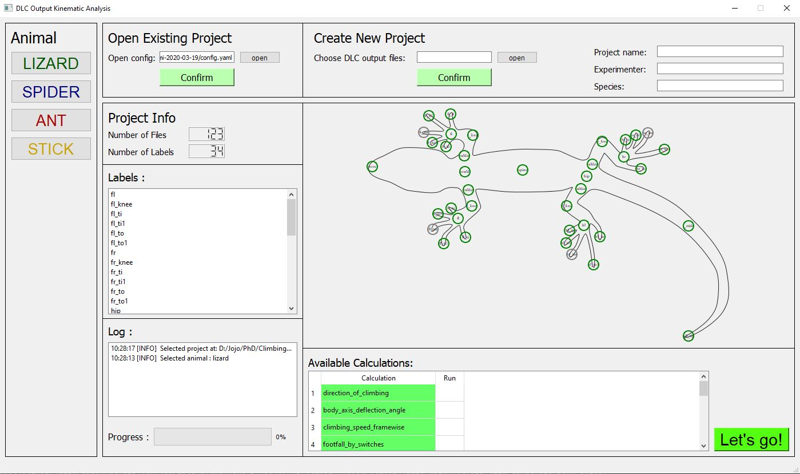
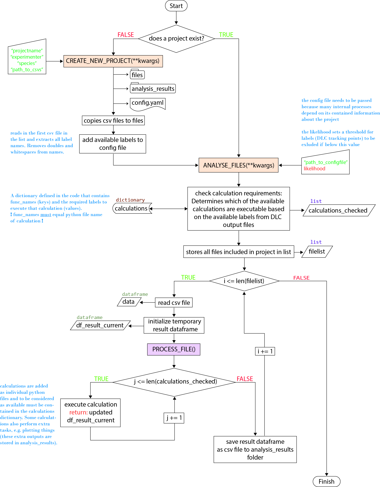
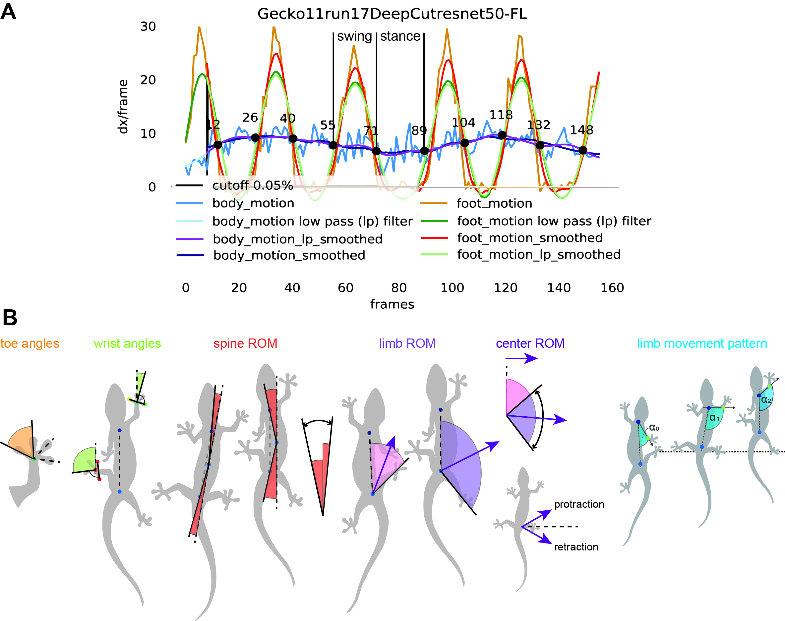

# ClimbingLizardDLCAnalysis
This program performs species-independent kinematic parameter calculations taking the DeepLabCut csv output files as input.
A GUI is now available to make the use of this program easier:



Depending on the selected animals different calculations are available, which will be executed for each csv file, if the
required labels to run the calculations are available.
For any animal the basic program flow looks like this:



The process_file() function is called for every file included in the project (every DLC output csv), which loops through 
all available calculations. For some calculations the knowledge about the step-phases is essential. Therefore a 
step detection algorithm using rel. feet to body velocities is implemented.
Some kinematic parameters that can be calculated for lizards are shown below:



## Install

git clone git@github.com:JojoReikun/ClimbingLizardDLCAnalysis.git

To run the project on Ubuntu, you need to install Pillow and TKinter:
```
sudo apt-get update
sudo apt-get install python3-tk python3-pil python3-pil.imagetk
```
## Run OVERVIEW
Works in the Pycharm (JetBrains) console. 'Lizardanalysis' is supposed to be a click program executable via anaconda 
console, but it hasn't been tested yet.
```
>> import lizardanalysis
>> path_to_csv = r'path to input csv files'
>> args = {'project': 'project_name',
           'experimenter': 'your name',
           'species': 'investigated species',
           'file_directory': path_to_csv }
```
change framerate and shutterspeed in config.yaml
```
>> lizardanalysis.create_new_project(**args)
>> config = r'path_to_config.yaml'
```
all arguments other than config are _optional_. The default values which will be passed if not set otherwise are displayed here.
```
>> lizardanalysis.analyze_files(config, likelihood=0.90)
>> lizardanalysis.summarize_results(config, plotting=False, direction_filter=True)
```

---
## Run DETAIL

open python console in Pycharm

**1st)** import toolbox lizardanalysis: 
```
>> import lizardanalysis
```
---
**2nd)** define variables to pass in args dictionary {key:value, key2:value2, ...}:  
* project: choose any project name
* experimenter: the name of the person who is running the project = you ;)
* species: enter the species name. If multiple either put them all in one string or name a group
* file_directory: filepath to the file directory which contains all csv output files from DeepLabCut.\
(__If on Windows:__ put r' ' aroud the path)

(can also be done in function call, if you want to do that skip step 2)  
_obviously:_ replace values of dictionaries (e.g. "project_name") with your inputs
```
>> path_to_csv = r'path to input csv files'
>> args = {'project': 'project_name',
           'experimenter': 'your name',
           'species': 'investigated species',
           'file_directory': path_to_csv }
```
---
**3rd)** call function to create a new project:  
--> if you did step 2, just pass the arguments to the function like this:
```
>> lizardanalysis.create_new_project(**args)
```
--> if you skipped step 2, call the function and pass the arguments inside the call:
```
>> lizardanalysis.create_new_project('project_name', 'your name', 'investigated species', path_to_csv)
```
*example:*\
 lizardanalysis.create_new_project('geckos', 'jojo', 'hemidactylusFrenatus', r'C:\Users\JojoS\Documents\phd\ClimbingRobot_XGen4\ClimbingLizardDLCAnalysis\all_csv')

---
**!!!If you have just created the project and this is the first time you analyze it, you have to change _framerate_ and _shutterspeed_ in the config.yaml file**!!!

**4th)** call function to analyze all the csv files.\
you can either define the config path as a variable beforehand or just pass the path in the function call
```
>> config = r'path_to_config.yaml'
```
*example:*\
config = r'C:\Users\JojoS\Documents\phd\ClimbingRobot_XGen4\ClimbingLizardDLCAnalysis\geckos-jojo-hemidactylusFrenatus-2020-04-16\config.yaml'

now call the function to start the analysis:
```
>> lizardanalysis.analyze_files(config)
```
There is an optional argument you can pass in this function: likelihood (default = 0.90).
This determines the likelihood limit, so that labels with a likelihood below will be set to NaN values in results 
and not included in calculations. If you want to pass this, the function looks like this:
```
>> lizardanalysis.analyze_files(config, likelihood=0.95)
```

---
**5th)** call function to summarize all results species-wise.

**-- This is still "work in progress", please wait for updates! --**
* plotting (bool): If True this generates speecies-wise overview plots
* direction_filter (bool): If True the species-wise results will also be seperated by direction
```
>> lizardanalysis.summarize_results(config, plotting=False, direction_filter=True)
```
