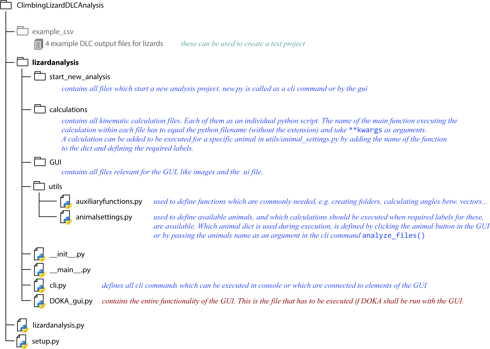
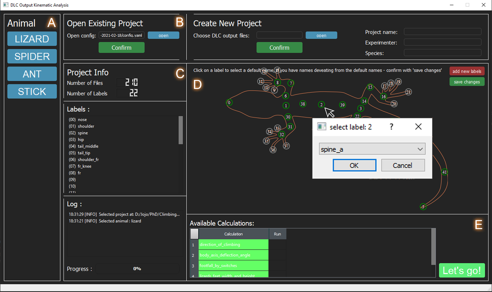

# Contributors:
JojoReikun: Johanna T. Schultz

FabianPlum: Fabian Plum

# ClimbingLizardDLCAnalysis (DOKA)
This software tool is being developed for making multi-species comparison easier and to facilitate kinematic analyses for many individuals. 
It is designed to take the tracked data from DeepLabCut (csv output files) as input and then automatically perform species-independent kinematic calculations.
Tracked data with the same file formatting as the DLC outputs can also be used. To view how to use DeepLabCut for markerless pose-estimation see: https://github.com/DeepLabCut/DeepLabCut

ClimbingLizardDLCAnalysis is currently set-up to work for 4 different animals (even with different number of legs): Lizards, Spiders, Ants and Stickinsects.
The software structure was built to make it easy to adjust the kinematic analysis to individual needs and allows to easily add new calculations as their own python scripts, which can then be executed as part of the analysis. This software will then generate new csv files for every run within the analysis_results folder of the DOKA project, which contains the results of all kinematic calculations. Details on what the calculations do individually can be found in the comments section of the individual .py files. 

We hope to make this a collaborative and constantly growing script, which facilitates analysis of animal biomechanisc for many groups. A more detailed description of what the software contains and how calculations can be added can be found further below (Overview over the program structure).

## A few features of this script in keynotes:
- works for 4 groups of animals (from top-view) so far: Lizards, Spiders, Ants, and Stickinsects
- works species independent and therefore facilitates multi-species analyses
- easy to add new calculations
- GUI or command line input (cli)
- so far allows a maximum of certain pre-defined labels per animal, but functionality to add own marker positions in GUI will be added soon.
- label names don't matter, they can be reconfigured to match defaults in the GUI
- we are working on more features!!

A **GUI** is now available to make the use of this program easier, detailed instructions on the usage are given in section "Run DOKA" below.

## Overview over the program structure:
This chart displays the program structure, how calculations or even animals could be added and where which functionality can be found.



## Overview over the basic program flow:
For any animal the basic program flow looks like this:


The process_file() function is called for every file included in the project (every DLC output csv), which loops through 
all available calculations. 

## Platforms:
DOKA is generally functional across platforms. It has been mainly developed on Windows 10 64-bit, but also tested on linux ubuntu (v: ), and iOS (v: MacOS BigSur 11.2.3)

## Install
git clone git@github.com/JojoReikun/ClimbingLizardDLCAnalysis.git

### Requirements
All library requirements can be found in ```requirements.txt```, it is recommended to create a virtual environment for this project.

An anaconda environment ( ```DOKA.yaml``` ) is provided to make the installation process as easy as possible.

#### Using anaconda: (OS independent)
Create the virtual DOKA environment:
```
conda env create -f DOKA.yaml
conda activate DOKA
```

In case the user prefers to manually install the requirements this can be done as follows:
**Note:** If you are using the preconfigured conda environment, you will **not** need to follow these steps!
#### iOS:
A virtual environment can be created using the following commands, the requirements.txt can then be used to install library requirements for DOKA within the venv:
```
pip install virtualenv
virtualenv doka
source doka/bin/activate
pip install -r requirements.txt
```
To upgrade certain packages run:
```
python3 -m pip install --upgrade pip
python3 -m pip install --upgrade Pillow
```

#### Ubuntu:
To upgrade important packages run:
```
sudo apt-get update
sudo apt-get install python3-tk python3-pil python3-pil.imagetk
```

#### Windows:
To upgrade certain packages run:
```
pip install --upgrade pip
```

---
---
# Run DOKA:
The software can be used either with the GUI or through command line input. Both functionalities are described below. Note that the GUI does not yet include all functions which can be executed via cli.

## GUI
The GUI so far has to be started through Pycharm



A) Select the animal you want to analyse. If your animal is not included, you can either include it yourself, or message us and we will see waht we can do.
Once the animal is selected the responding silhouette and the default labels appear in the big window.

B) An existing project config.yaml can be loaded. Or a new project can be created. Usually using DOKA for the first time, requires to make a new project. This will involve to choose a project name, give the experimenter name and name the species. If multiple species are involved make this the family, it doesn't really matter. The folder which contains all the DeepLabCut result csv files which the user wishes to include in the project has to be selected with "open". Once all these things are done, click confirm and a new project will be generated. There will be a config.yaml file in the project folder, within which framerate and shutterspeed have to be entered before proceeding to the next step. The newly generated project automatically appears in the "Existing Project" section. Hit the confirm button in this section --> C

C) Once an existing project is confirmed, the number of files and the available labels will be displayed. Available labels appear green. If your label name does not match the default name, they appear grey, but label names can be reconfigured --> D
A log tells you what to do or what was done by the software.

D) Displays default, non-available (grey), and available labels (green) in a visual way. By clicking on the label in this window, a pop-up window appears which allows you to choose one of the default label names for that label, in case naming of labels in your project are different to the default. The name will be adjusted and thereby recognized by the software, the label should now appear green. 
In future the option to add your own labels on the animal will be included. These can then be used in your own calculations. Currently that would have to be done "behind the scenes" in the code.

E) Displays all for that animal existing calculations and marks all available calculations (determined by which labels are there/green) in green.
In future instead of executing all green calculations, there will be an option to select or deselect the calculations to be run.
Hit Let's GO and the progress bar should now indicate just that - the progress.


## Command Line:
So far works best in the Pycharm (JetBrains) console. 'Lizardanalysis' is supposed to be a click program executable via anaconda console, but it hasn't been tested yet. 

### Fast through
This section is just to remind the user of the steps once more familiar with the usage of the software, a detailed instruction for using command line inputs can be found below.

Import the module:

```
>> import lizardanalysis
```
Now prepare to start a new project, if project already exists, proceed to analyze_files and pass the config path to that project.
```
>> path_to_csv = r'path to input csv files'
>> args = {'project': 'project_name',
           'experimenter': 'your name',
           'species': 'investigated species',
           'file_directory': path_to_csv }
>> lizardanalysis.create_new_project(**args)
>> config = r'path_to_config.yaml'
```
Now change framerate and shutterspeed in config.yaml

```
>> lizardanalysis.analyze_files(config, likelihood=0.90)
```
For the tail biomechanics project a summarize stepwise function exists, which is so far only functional if variable conventions are the same as in:
"Tail deflection but not bending varies with speed in lizards: results from an automated tracking analysis pipeline" by Schultz et al., 2021 (ICB)
```
>> lizardanalysis.analyze_files(config, likelihood=0.90)
>> lizardanalysis.summarize_stepwise(config)
```

---
### Detailed instructions:

open python console in Pycharm

**1st)** import toolbox lizardanalysis: 
```
>> import lizardanalysis
```

**2nd)** Prepare to create a new project. Skip step 2 and 3 if a project already exists. Define variables to pass in args dictionary {key:value, key2:value2, ...}:  
* project: choose any project name
* experimenter: the name of the person who is running the project = you ;)
* species: enter the species name. If multiple either put them all in one string or name a group/family (be careful not to make these too long, as they will be used to create the folder name. Long filepaths can cause problems)
* file_directory: filepath to the file directory which contains all csv output files from DeepLabCut which shall be included in the project.\
(__If on Windows:__ put r' ' aroud the path)
Alternatively the values can also be passed in the function call directly (see step3)

_obviously:_ replace values of dictionaries (e.g. "project_name") with your inputs
```
>> path_to_csv = r'path to input csv files'
>> args = {'project': 'project_name',
           'experimenter': 'your name',
           'species': 'investigated species',
           'file_directory': path_to_csv }
```

**3rd)** call function to create a new project:  
This will generate a new folder using "project", "experimenter", "species", and the date as the filename, which contains all the DLC csv files which were selected, and a config.yaml file which "defines" the project. Later more elements will be added.
--> if you did step 2, just pass the arguments to the function like this:
```
>> lizardanalysis.create_new_project(**args)
```
--> if you skipped step 2, call the function and pass the arguments inside the call:
```
>> lizardanalysis.create_new_project('project_name', 'your name', 'investigated species', path_to_csv)
```
*example:*\
 lizardanalysis.create_new_project('geckos', 'jojo', 'hemidactylusFrenatus', r'C:\Users\JojoS\Documents\phd\ClimbingRobot_XGen4\ClimbingLizardDLCAnalysis\example_csv')


**!!!If you have just created the project and this is the first time you analyze it, you have to change _framerate_ and _shutterspeed_ in the config.yaml file**!!!
There are other inputs which are optional, e.g. when was species caught etc. to help to keep experimental log book data together.

**4th)** call function to analyze all the csv files.\
you can either define the config path as a variable beforehand or just pass the path in the function call
```
>> config = r'path_to_config.yaml'
```
*example:*\
config = r'C:\Users\JojoS\Documents\phd\ClimbingRobot_XGen4\ClimbingLizardDLCAnalysis\geckos-jojo-hemidactylusFrenatus-2020-04-16\config.yaml'

now call the function to start the analysis:
```
>> lizardanalysis.analyze_files(config)
```
There is an optional argument you can pass in this function: likelihood (default = 0.90).
This determines the likelihood limit, so that labels with a likelihood below will be set to NaN values in results 
and not included in calculations. The likelihood values result from the DeepLabCut toolbox and describes basically how accurate the determined label location is thought to be. If you want to pass the likelihood limit as higher, the function looks like this:
```
>> lizardanalysis.analyze_files(config, likelihood=0.95)
```

**5th)** This work for the tial biomechanics project only so far and is sensitive to variable naming conventions...
call function to summarize all results step-wise.

**-- This is still "work in progress", please wait for updates! --**
* plotting (bool): If True this generates speecies-wise overview plots
* direction_filter (bool): If True the species-wise results will also be seperated by direction
```
>> lizardanalysis.summarize_stepwise(config)
```
